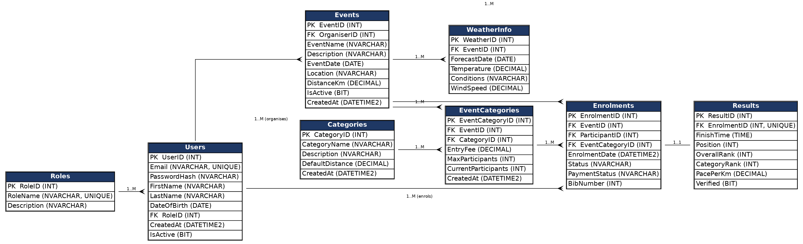

# RaceDay Event Management System

## Project Description

RaceDay is a web-based event management system for South African road
running, walking and cycling events. Event Organisers can create and manage
events, categories, and participant results. Participants can browse
upcoming events, enrol in a category, track their personal performance
history, and prepare for race day using route and weather information.

This is Part 1 of the project (PROG6212 – Programming 2B), where the system
is planned and the database is designed and built, before any API code is
written in Part 2.

## User Roles

### Organiser
- Create, edit and delete events
- Add categories to an event and set the entry fee/participant cap
- View who has enrolled in each event category
- Capture and correct race results

### Participant
- Browse upcoming events and their categories
- Enrol in an event category and receive a bib number
- Track their own enrolments and payment status
- View their own race results once published

## Data Model (Section A – ERD)

The database has 8 entities:

| Entity | Purpose |
|---|---|
| Roles | Lookup table for the two roles: Organiser and Participant |
| Users | Every user account; RoleID says whether they are an Organiser or Participant |
| Events | A race event created and owned by one Organiser |
| Categories | A reusable master list of race distances (e.g. 5km, 10km, Half Marathon) |
| EventCategories | Links a Category to a specific Event, with that event's entry fee and participant cap |
| Enrolments | A Participant enrolling into one EventCategory |
| Results | The finishing result captured for one Enrolment (one-to-one) |
| WeatherInfo | Optional forecast information linked to an Event |

**Relationships:**
- Roles -> Users (1-to-many)
- Users -> Events (1-to-many, an Organiser creates many Events)
- Events -> EventCategories (1-to-many)
- Categories -> EventCategories (1-to-many)
- Events -> Enrolments (1-to-many)
- Users -> Enrolments (1-to-many, a Participant makes many Enrolments)
- EventCategories -> Enrolments (1-to-many, capped by MaxParticipants)
- Enrolments -> Results (1-to-1)
- Events -> WeatherInfo (1-to-many)

## API Endpoint Plan (Section B)

See [docs/RaceDay_API_Endpoint_Plan.pdf](docs/RaceDay_API_Endpoint_Plan.pdf)
for the full endpoint table covering Authentication, User Profile, Events,
Categories, Enrolments, and Results.
